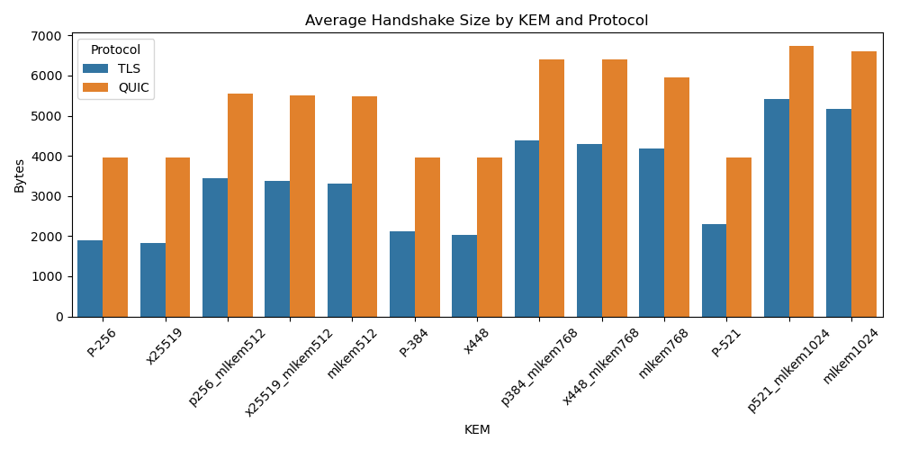

# Full Handshake Performance Analysis in TLS and QUIC

## Level 1 — Protocol TLS

### Summary Statistics by KEM

| KEM | Type | Mean | Median | Std | Min | Max | Size (bytes) |
|-----|------|------|--------|-----|-----|-----|---------------|
`P-256` | Traditional | 2.49 | 2.41 | 0.38 | 1.74 | 5.32 | 1888
`mlkem512` | Post-quantum | 2.49 | 2.40 | 0.36 | 1.78 | 3.72 | 3318
`p256_mlkem512` | Hybrid | 9.36 | 8.93 | 1.37 | 7.16 | 14.16 | 3448
`x25519` | Traditional | 2.20 | 2.13 | 0.36 | 1.54 | 4.34 | 1822
`x25519_mlkem512` | Hybrid | 2.50 | 2.37 | 0.43 | 2.01 | 4.60 | 3382
- Shapiro-Wilk for Traditional: p = 0.0000
- Shapiro-Wilk for Hybrid: p = 0.0000
- Shapiro-Wilk for Post-quantum: p = 0.0000
- Levene’s Test for homogeneity: p = 0.0000
- T-test between Traditional and Hybrid: p = 0.0000 (unequal var)
- T-test between Traditional and Post-quantum: p = 0.0000 (unequal var)
- T-test between Hybrid and Post-quantum: p = 0.0000 (unequal var)

## Level 1 — Protocol QUIC

### Summary Statistics by KEM

| KEM | Type | Mean | Median | Std | Min | Max | Size (bytes) |
|-----|------|------|--------|-----|-----|-----|---------------|
`P-256` | Traditional | 2.79 | 2.67 | 0.37 | 2.23 | 4.43 | 3963
`mlkem512` | Post-quantum | 2.65 | 2.56 | 0.33 | 2.05 | 4.91 | 5483
`p256_mlkem512` | Hybrid | 11.91 | 10.86 | 2.02 | 10.10 | 18.14 | 5548
`x25519` | Traditional | 2.36 | 2.27 | 0.29 | 1.95 | 3.48 | 3963
`x25519_mlkem512` | Hybrid | 4.64 | 4.38 | 0.59 | 3.98 | 7.43 | 5515
- Shapiro-Wilk for Traditional: p = 0.0000
- Shapiro-Wilk for Hybrid: p = 0.0000
- Shapiro-Wilk for Post-quantum: p = 0.0000
- Levene’s Test for homogeneity: p = 0.0000
- T-test between Traditional and Hybrid: p = 0.0000 (unequal var)
- T-test between Traditional and Post-quantum: p = 0.0003 (unequal var)
- T-test between Hybrid and Post-quantum: p = 0.0000 (unequal var)

## Level 3 — Protocol TLS

### Summary Statistics by KEM

| KEM | Type | Mean | Median | Std | Min | Max | Size (bytes) |
|-----|------|------|--------|-----|-----|-----|---------------|
`P-384` | Traditional | 11.12 | 10.48 | 1.96 | 8.38 | 17.59 | 2115
`mlkem768` | Post-quantum | 5.71 | 5.35 | 0.93 | 4.60 | 9.57 | 4184
`p384_mlkem768` | Hybrid | 27.31 | 19.66 | 160.25 | 15.42 | 3602.88 | 4380
`x448` | Traditional | 7.09 | 7.02 | 1.16 | 5.15 | 10.86 | 2032
`x448_mlkem768` | Hybrid | 8.18 | 7.54 | 1.45 | 6.28 | 13.39 | 4297
- Shapiro-Wilk for Traditional: p = 0.0000
- Shapiro-Wilk for Hybrid: p = 0.0000
- Shapiro-Wilk for Post-quantum: p = 0.0000
- Levene’s Test for homogeneity: p = 0.0230
- T-test between Traditional and Hybrid: p = 0.0165 (unequal var)
- T-test between Traditional and Post-quantum: p = 0.0000 (unequal var)
- T-test between Hybrid and Post-quantum: p = 0.0008 (unequal var)

## Level 3 — Protocol QUIC

### Summary Statistics by KEM

| KEM | Type | Mean | Median | Std | Min | Max | Size (bytes) |
|-----|------|------|--------|-----|-----|-----|---------------|
`P-384` | Traditional | 6.93 | 6.30 | 1.09 | 5.99 | 11.06 | 3963
`mlkem768` | Post-quantum | 3.96 | 3.85 | 0.43 | 3.49 | 6.46 | 5949
`p384_mlkem768` | Hybrid | 14.73 | 14.34 | 1.18 | 13.87 | 22.95 | 6403
`x448` | Traditional | 5.09 | 4.77 | 0.71 | 4.42 | 8.27 | 3963
`x448_mlkem768` | Hybrid | 7.29 | 7.07 | 0.67 | 6.72 | 10.91 | 6403
- Shapiro-Wilk for Traditional: p = 0.0000
- Shapiro-Wilk for Hybrid: p = 0.0000
- Shapiro-Wilk for Post-quantum: p = 0.0000
- Levene’s Test for homogeneity: p = 0.0000
- T-test between Traditional and Hybrid: p = 0.0000 (unequal var)
- T-test between Traditional and Post-quantum: p = 0.0000 (unequal var)
- T-test between Hybrid and Post-quantum: p = 0.0000 (unequal var)

## Level 5 — Protocol TLS

### Summary Statistics by KEM

| KEM | Type | Mean | Median | Std | Min | Max | Size (bytes) |
|-----|------|------|--------|-----|-----|-----|---------------|
`P-521` | Traditional | 22.16 | 20.56 | 3.50 | 18.09 | 33.94 | 2298
`mlkem1024` | Post-quantum | 11.09 | 10.18 | 2.06 | 8.68 | 19.63 | 5160
`p521_mlkem1024` | Hybrid | 32.96 | 32.01 | 4.66 | 26.56 | 50.00 | 5426
- Shapiro-Wilk for Traditional: p = 0.0000
- Shapiro-Wilk for Hybrid: p = 0.0000
- Shapiro-Wilk for Post-quantum: p = 0.0000
- Levene’s Test for homogeneity: p = 0.0000
- T-test between Traditional and Hybrid: p = 0.0000 (unequal var)
- T-test between Traditional and Post-quantum: p = 0.0000 (unequal var)
- T-test between Hybrid and Post-quantum: p = 0.0000 (unequal var)

## Level 5 — Protocol QUIC

### Summary Statistics by KEM

| KEM | Type | Mean | Median | Std | Min | Max | Size (bytes) |
|-----|------|------|--------|-----|-----|-----|---------------|
`P-521` | Traditional | 6.33 | 6.05 | 0.81 | 5.60 | 10.25 | 3963
`mlkem1024` | Post-quantum | 4.67 | 4.34 | 0.68 | 3.84 | 6.80 | 6598
`p521_mlkem1024` | Hybrid | 14.99 | 14.46 | 1.78 | 13.57 | 22.86 | 6731
- Shapiro-Wilk for Traditional: p = 0.0000
- Shapiro-Wilk for Hybrid: p = 0.0000
- Shapiro-Wilk for Post-quantum: p = 0.0000
- Levene’s Test for homogeneity: p = 0.0000
- T-test between Traditional and Hybrid: p = 0.0000 (unequal var)
- T-test between Traditional and Post-quantum: p = 0.0000 (unequal var)
- T-test between Hybrid and Post-quantum: p = 0.0000 (unequal var)

# Summary by Protocol and Level (excluding >1000 ms)

| Protocol | Level | Mean | Std | CV | % Outliers |
|----------|:-----:|-----:|----:|---:|-----------:|
QUIC | 1 | 4.87 | 3.74 | 0.77 | 20.00%
QUIC | 3 | 7.60 | 3.86 | 0.51 | 20.00%
QUIC | 5 | 8.66 | 4.68 | 0.54 | 0.00%
TLS | 1 | 3.81 | 2.87 | 0.75 | 20.12%
TLS | 3 | 10.44 | 5.49 | 0.53 | 6.40%
TLS | 5 | 22.07 | 9.62 | 0.44 | 0.00%

# Detail by Protocol, Level and KEM (excluding >1000 ms)

| Protocol | Level | KEM | Mean | Std | CV | % Outliers | Shapiro p | Levene p |
|----------|:-----:|:----|-----:|----:|---:|-----------:|----------:|---------:|
QUIC | 1 | `P-256` | 2.79 | 0.37 | 0.13 | 1.40% | 3.47e-17 | 4.14e-106
QUIC | 1 | `mlkem512` | 2.65 | 0.33 | 0.13 | 6.80% | 7.01e-18 | 4.14e-106
QUIC | 1 | `p256_mlkem512` | 11.91 | 2.02 | 0.17 | 17.80% | 4.79e-28 | 4.14e-106
QUIC | 1 | `x25519` | 2.36 | 0.29 | 0.12 | 3.80% | 2.41e-18 | 4.14e-106
QUIC | 1 | `x25519_mlkem512` | 4.64 | 0.59 | 0.13 | 9.60% | 1.73e-25 | 4.14e-106
QUIC | 3 | `P-384` | 6.93 | 1.09 | 0.16 | 0.60% | 5.28e-27 | 2.59e-22
QUIC | 3 | `mlkem768` | 3.96 | 0.43 | 0.11 | 10.20% | 3.16e-28 | 2.59e-22
QUIC | 3 | `p384_mlkem768` | 14.73 | 1.18 | 0.08 | 13.40% | 9.93e-34 | 2.59e-22
QUIC | 3 | `x448` | 5.09 | 0.71 | 0.14 | 8.20% | 4.07e-27 | 2.59e-22
QUIC | 3 | `x448_mlkem768` | 7.29 | 0.67 | 0.09 | 13.40% | 6.25e-31 | 2.59e-22
QUIC | 5 | `P-521` | 6.33 | 0.81 | 0.13 | 13.00% | 1.55e-28 | 1.52e-15
QUIC | 5 | `mlkem1024` | 4.67 | 0.68 | 0.15 | 11.40% | 5.31e-26 | 1.52e-15
QUIC | 5 | `p521_mlkem1024` | 14.99 | 1.78 | 0.12 | 11.80% | 2.33e-31 | 1.52e-15
TLS | 1 | `P-256` | 2.49 | 0.38 | 0.15 | 0.40% | 7.74e-15 | 5.89e-172
TLS | 1 | `mlkem512` | 2.49 | 0.36 | 0.14 | 1.80% | 2.26e-12 | 5.89e-172
TLS | 1 | `p256_mlkem512` | 9.36 | 1.37 | 0.15 | 1.00% | 2.80e-17 | 5.89e-172
TLS | 1 | `x25519` | 2.20 | 0.36 | 0.16 | 0.60% | 1.51e-11 | 5.89e-172
TLS | 1 | `x25519_mlkem512` | 2.50 | 0.43 | 0.17 | 9.40% | 1.58e-25 | 5.89e-172
TLS | 3 | `P-384` | 11.12 | 1.96 | 0.18 | 0.40% | 3.41e-17 | 1.22e-159
TLS | 3 | `mlkem768` | 5.71 | 0.93 | 0.16 | 6.40% | 1.11e-23 | 1.22e-159
TLS | 3 | `p384_mlkem768` | 20.14 | 3.02 | 0.15 | 0.00% | 1.03e-13 | 1.22e-159
TLS | 3 | `x448` | 7.09 | 1.16 | 0.16 | 0.20% | 7.79e-13 | 1.22e-159
TLS | 3 | `x448_mlkem768` | 8.18 | 1.45 | 0.18 | 1.20% | 4.96e-19 | 1.22e-159
TLS | 5 | `P-521` | 22.16 | 3.50 | 0.16 | 1.20% | 2.46e-21 | 8.82e-40
TLS | 5 | `mlkem1024` | 11.09 | 2.06 | 0.19 | 0.40% | 2.16e-19 | 8.82e-40
TLS | 5 | `p521_mlkem1024` | 32.96 | 4.66 | 0.14 | 0.60% | 4.37e-15 | 8.82e-40

# Pairwise Welch’s t-test (excluding >1000 ms)

| Protocol | Level | KEM1 | KEM2 | Welch’s p-value |
|----------|:-----:|:----:|:----:|----------------:|
QUIC | 1 | `P-256` | `mlkem512` | 2.68e-10
QUIC | 1 | `P-256` | `p256_mlkem512` | 0.00e+00
QUIC | 1 | `P-256` | `x25519` | 1.42e-76
QUIC | 1 | `P-256` | `x25519_mlkem512` | 8.52e-304
QUIC | 1 | `mlkem512` | `p256_mlkem512` | 0.00e+00
QUIC | 1 | `mlkem512` | `x25519` | 2.24e-42
QUIC | 1 | `mlkem512` | `x25519_mlkem512` | 5.93e-323
QUIC | 1 | `p256_mlkem512` | `x25519` | 0.00e+00
QUIC | 1 | `p256_mlkem512` | `x25519_mlkem512` | 6.41e-308
QUIC | 1 | `x25519` | `x25519_mlkem512` | 0.00e+00
QUIC | 3 | `P-384` | `mlkem768` | 6.96e-254
QUIC | 3 | `P-384` | `p384_mlkem768` | 0.00e+00
QUIC | 3 | `P-384` | `x448` | 4.81e-147
QUIC | 3 | `P-384` | `x448_mlkem768` | 4.84e-10
QUIC | 3 | `mlkem768` | `p384_mlkem768` | 0.00e+00
QUIC | 3 | `mlkem768` | `x448` | 6.81e-137
QUIC | 3 | `mlkem768` | `x448_mlkem768` | 0.00e+00
QUIC | 3 | `p384_mlkem768` | `x448` | 0.00e+00
QUIC | 3 | `p384_mlkem768` | `x448_mlkem768` | 0.00e+00
QUIC | 3 | `x448` | `x448_mlkem768` | 5.21e-277
QUIC | 5 | `P-521` | `mlkem1024` | 3.83e-174
QUIC | 5 | `P-521` | `p521_mlkem1024` | 0.00e+00
QUIC | 5 | `mlkem1024` | `p521_mlkem1024` | 0.00e+00
TLS | 1 | `P-256` | `mlkem512` | 9.81e-01
TLS | 1 | `P-256` | `p256_mlkem512` | 0.00e+00
TLS | 1 | `P-256` | `x25519` | 3.26e-32
TLS | 1 | `P-256` | `x25519_mlkem512` | 6.04e-01
TLS | 1 | `mlkem512` | `p256_mlkem512` | 0.00e+00
TLS | 1 | `mlkem512` | `x25519` | 1.28e-34
TLS | 1 | `mlkem512` | `x25519_mlkem512` | 6.08e-01
TLS | 1 | `p256_mlkem512` | `x25519` | 0.00e+00
TLS | 1 | `p256_mlkem512` | `x25519_mlkem512` | 0.00e+00
TLS | 1 | `x25519` | `x25519_mlkem512` | 7.40e-31
TLS | 3 | `P-384` | `mlkem768` | 9.88e-262
TLS | 3 | `P-384` | `p384_mlkem768` | 3.78e-288
TLS | 3 | `P-384` | `x448` | 2.81e-191
TLS | 3 | `P-384` | `x448_mlkem768` | 2.93e-118
TLS | 3 | `mlkem768` | `p384_mlkem768` | 0.00e+00
TLS | 3 | `mlkem768` | `x448` | 4.36e-78
TLS | 3 | `mlkem768` | `x448_mlkem768` | 1.53e-147
TLS | 3 | `p384_mlkem768` | `x448` | 0.00e+00
TLS | 3 | `p384_mlkem768` | `x448_mlkem768` | 0.00e+00
TLS | 3 | `x448` | `x448_mlkem768` | 3.26e-36
TLS | 5 | `P-521` | `mlkem1024` | 2.68e-304
TLS | 5 | `P-521` | `p521_mlkem1024` | 4.34e-213
TLS | 5 | `mlkem1024` | `p521_mlkem1024` | 0.00e+00

# TLS vs QUIC Comparison

- Level 1 — Traditional: TLS mean = 2.34, QUIC mean = 2.58, p = 0.0000
- Level 1 — Hybrid: TLS mean = 5.93, QUIC mean = 8.28, p = 0.0000
- Level 1 — Post-quantum: TLS mean = 2.49, QUIC mean = 2.65, p = 0.0000
- Level 3 — Traditional: TLS mean = 9.10, QUIC mean = 6.01, p = 0.0000
- Level 3 — Hybrid: TLS mean = 17.74, QUIC mean = 11.01, p = 0.0615
- Level 3 — Post-quantum: TLS mean = 5.71, QUIC mean = 3.96, p = 0.0000
- Level 5 — Traditional: TLS mean = 22.16, QUIC mean = 6.33, p = 0.0000
- Level 5 — Hybrid: TLS mean = 32.96, QUIC mean = 14.99, p = 0.0000
- Level 5 — Post-quantum: TLS mean = 11.09, QUIC mean = 4.67, p = 0.0000

# Time vs Size Ratio

| Level | Protocol | Type | Mean Ratio (ms/byte) | Std |
|-------|----------|------|----------------------|------|
1 | QUIC | Hybrid | 0.001494 | 0.000705
1 | QUIC | Post-quantum | 0.000483 | 0.000061
1 | QUIC | Traditional | 0.000650 | 0.000099
1 | TLS | Hybrid | 0.001727 | 0.001031
1 | TLS | Post-quantum | 0.000750 | 0.000108
1 | TLS | Traditional | 0.001262 | 0.000207
3 | QUIC | Hybrid | 0.001720 | 0.000600
3 | QUIC | Post-quantum | 0.000666 | 0.000072
3 | QUIC | Traditional | 0.001516 | 0.000329
3 | TLS | Hybrid | 0.004069 | 0.025950
3 | TLS | Post-quantum | 0.001366 | 0.000223
3 | TLS | Traditional | 0.004373 | 0.001174
5 | QUIC | Hybrid | 0.002227 | 0.000264
5 | QUIC | Post-quantum | 0.000708 | 0.000103
5 | QUIC | Traditional | 0.001598 | 0.000205
5 | TLS | Hybrid | 0.006075 | 0.000859
5 | TLS | Post-quantum | 0.002150 | 0.000399
5 | TLS | Traditional | 0.009645 | 0.001523

# Outlier Analysis (IQR Method)

| Level | Protocol | KEM | Outliers | Total | Percent |
|-------|----------|-----|----------|--------|---------|
1 | TLS | `P-256` | 2 | 500 | 0.40%
1 | TLS | `x25519` | 3 | 500 | 0.60%
1 | TLS | `p256_mlkem512` | 5 | 500 | 1.00%
1 | TLS | `x25519_mlkem512` | 47 | 500 | 9.40%
1 | TLS | `mlkem512` | 9 | 500 | 1.80%
1 | QUIC | `P-256` | 7 | 500 | 1.40%
1 | QUIC | `x25519` | 19 | 500 | 3.80%
1 | QUIC | `p256_mlkem512` | 89 | 500 | 17.80%
1 | QUIC | `x25519_mlkem512` | 48 | 500 | 9.60%
1 | QUIC | `mlkem512` | 34 | 500 | 6.80%
3 | TLS | `P-384` | 2 | 500 | 0.40%
3 | TLS | `x448` | 1 | 500 | 0.20%
3 | TLS | `p384_mlkem768` | 1 | 500 | 0.20%
3 | TLS | `x448_mlkem768` | 6 | 500 | 1.20%
3 | TLS | `mlkem768` | 32 | 500 | 6.40%
3 | QUIC | `P-384` | 3 | 500 | 0.60%
3 | QUIC | `x448` | 41 | 500 | 8.20%
3 | QUIC | `p384_mlkem768` | 67 | 500 | 13.40%
3 | QUIC | `x448_mlkem768` | 67 | 500 | 13.40%
3 | QUIC | `mlkem768` | 51 | 500 | 10.20%
5 | TLS | `P-521` | 6 | 500 | 1.20%
5 | TLS | `p521_mlkem1024` | 3 | 500 | 0.60%
5 | TLS | `mlkem1024` | 2 | 500 | 0.40%
5 | QUIC | `P-521` | 65 | 500 | 13.00%
5 | QUIC | `p521_mlkem1024` | 59 | 500 | 11.80%
5 | QUIC | `mlkem1024` | 57 | 500 | 11.40%

# Combined Impact: Changing Level and KEM Type

This section evaluates the compounded penalty when upgrading security level and KEM category.

## Transition Summary Table
| Protocol | From → To | ΔTime (ms) | ΔSize (bytes) | %ΔTime | %ΔSize |
|----------|-----------|------------:|--------------:|-------:|-------:|
TLS | 1 Traditional → 5 Hybrid | 30.62 | 3571 | 1306.5% | 192.5%
TLS | 1 Traditional → 3 Hybrid | 15.40 | 2483 | 657.1% | 133.9%
QUIC | 1 Traditional → 5 Hybrid | 12.41 | 2768 | 481.9% | 69.8%
TLS | 1 Hybrid → 5 Hybrid | 27.03 | 2011 | 455.9% | 58.9%
TLS | 1 Traditional → 5 Post-quantum | 8.75 | 3305 | 373.4% | 178.2%
QUIC | 1 Traditional → 3 Hybrid | 8.44 | 2440 | 327.4% | 61.6%
TLS | 3 Traditional → 5 Hybrid | 23.86 | 3352 | 262.0% | 161.7%
TLS | 1 Hybrid → 3 Hybrid | 11.81 | 923 | 199.3% | 27.0%
QUIC | 3 Traditional → 5 Hybrid | 8.98 | 2768 | 149.5% | 69.8%
TLS | 1 Traditional → 3 Post-quantum | 3.37 | 2329 | 143.8% | 125.6%
TLS | 1 Hybrid → 5 Post-quantum | 5.17 | 1745 | 87.1% | 51.1%
TLS | 3 Hybrid → 5 Hybrid | 15.22 | 1087 | 85.8% | 25.1%
QUIC | 1 Traditional → 5 Post-quantum | 2.09 | 2635 | 81.3% | 66.5%
QUIC | 1 Hybrid → 5 Hybrid | 6.71 | 1199 | 81.1% | 21.7%
QUIC | 1 Traditional → 3 Post-quantum | 1.38 | 1986 | 53.8% | 50.1%
QUIC | 3 Hybrid → 5 Hybrid | 3.98 | 328 | 36.1% | 5.1%
QUIC | 1 Hybrid → 3 Hybrid | 2.74 | 871 | 33.1% | 15.8%
TLS | 3 Traditional → 5 Post-quantum | 1.99 | 3086 | 21.9% | 148.9%
TLS | 1 Hybrid → 3 Post-quantum | -0.22 | 769 | -3.6% | 22.5%
QUIC | 3 Traditional → 5 Post-quantum | -1.34 | 2635 | -22.3% | 66.5%
TLS | 3 Hybrid → 5 Post-quantum | -6.65 | 821 | -37.5% | 18.9%
QUIC | 1 Hybrid → 5 Post-quantum | -3.61 | 1066 | -43.6% | 19.3%
QUIC | 1 Hybrid → 3 Post-quantum | -4.31 | 417 | -52.1% | 7.5%
QUIC | 3 Hybrid → 5 Post-quantum | -6.34 | 195 | -57.6% | 3.0%